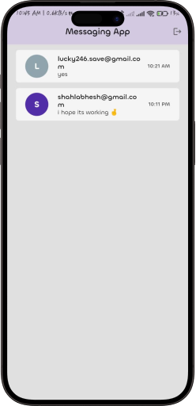
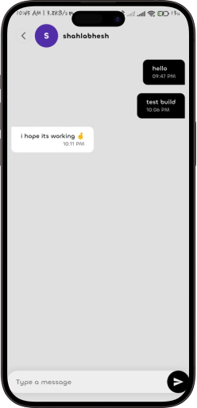
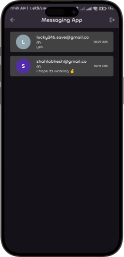
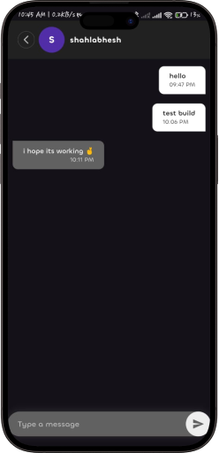

# ChatHive

ChatHive is a modern messaging app built with Flutter and Firebase. It features real-time messaging, user authentication, and a sleek UI with both light and dark themes.

## Features

- **User Authentication**: Register and log in using email and password.
- **Real-Time Messaging**: Send and receive messages in real-time.
- **User List**: View a list of all users, excluding the current user, along with the last message exchanged.
- **Light and Dark Themes**: Seamlessly switch between light and dark themes.

## Screenshots








## Installation

1. **Clone the repository**:
   ```bash
   git clone https://github.com/Shah-Labhesh/chathive.git
   cd chathive

2. **Get the dependencies**:
   ```bash
   flutter pub get

3. **Run the app**:
    ```bash
    flutter run
